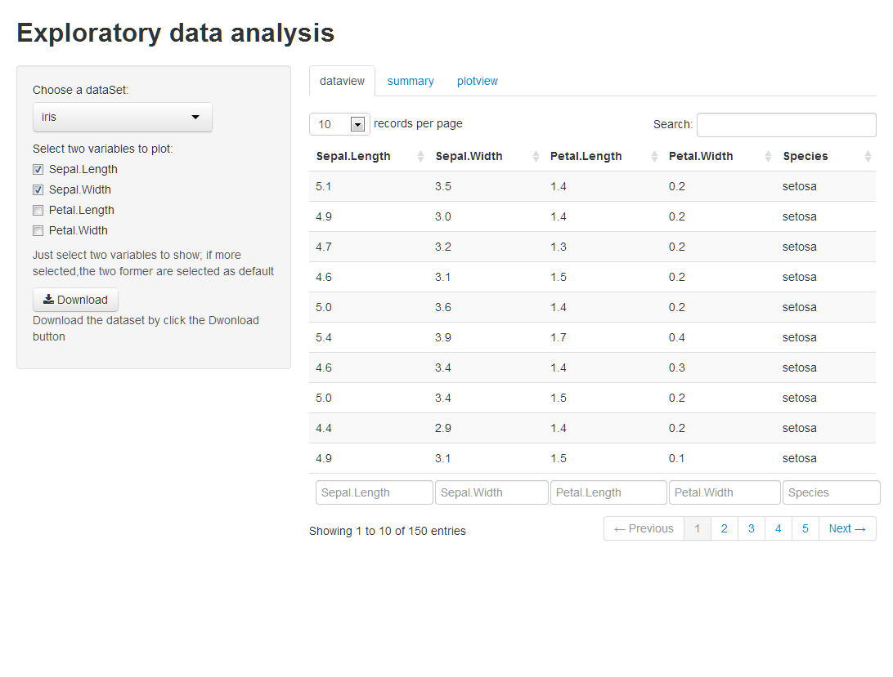
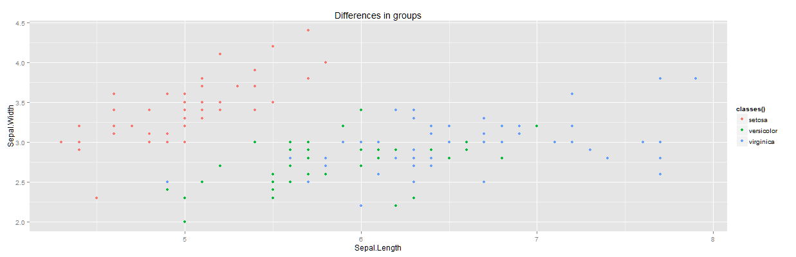

Presentation
========================================================
left:50%
author: mingchen
date: 2014.07.18
transition: rotate
font-family:'Helvetica'
autosize:true
Introduction
========================================================

In the jeferryApp, I developed an application to help you 
explorer the dataset.And more detail information, you can 
check the **README.md** in github show below. 
https://github.com/MingchenInSZ/jefferyApp.git

- Select dataset
- Choose variable to show
- Results

Example
========================================================

```r
  #runApp()
```
This is the initial view of the jefferyApp



Example(cont'd)
========================================================
This is the summary page:

```r
summary(iris)
```

```
  Sepal.Length   Sepal.Width    Petal.Length   Petal.Width 
 Min.   :4.30   Min.   :2.00   Min.   :1.00   Min.   :0.1  
 1st Qu.:5.10   1st Qu.:2.80   1st Qu.:1.60   1st Qu.:0.3  
 Median :5.80   Median :3.00   Median :4.35   Median :1.3  
 Mean   :5.84   Mean   :3.06   Mean   :3.76   Mean   :1.2  
 3rd Qu.:6.40   3rd Qu.:3.30   3rd Qu.:5.10   3rd Qu.:1.8  
 Max.   :7.90   Max.   :4.40   Max.   :6.90   Max.   :2.5  
       Species  
 setosa    :50  
 versicolor:50  
 virginica :50  
                
                
                
```
Example(cont'd)
========================================================
In plot view, it provides a sharp contrast two variabls
in groups.


